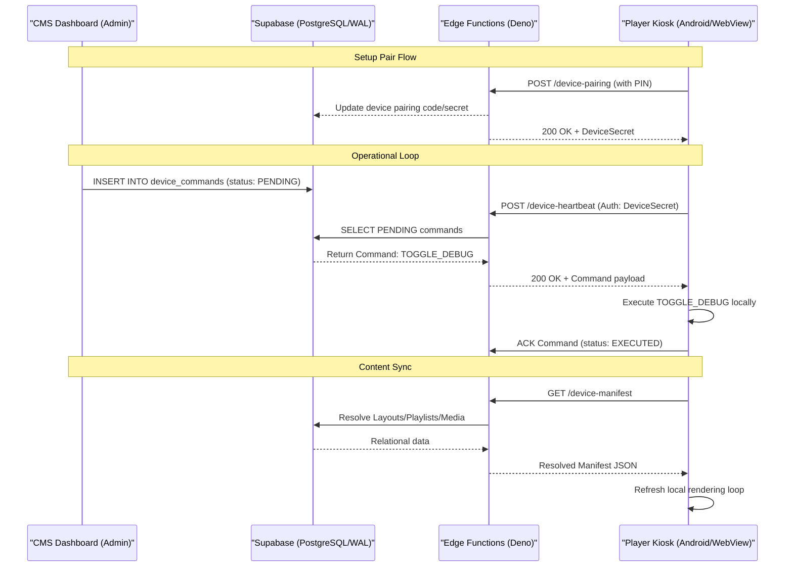

# System Architecture Intent

## 1. Architectural Vision
The Smart Retail Display System is designed for high-availability, low-latency content delivery to geographically distributed hardware (Android Kiosks). It prioritizes **stateless kiosks**, **manifest-driven logic**, and **seamless transitions**.

## 2. Distributed State Model
State flows between the **CMS (Origin)** and the **Kiosk (Target)** through three primary channels:

### A. The Control Plane (Commands)
- **Pattern:** Asynchronous Command Queue.
- **Flow:** CMS -> `device_commands` (Table) -> `device-heartbeat` (Edge Function Proxy) -> Kiosk.
- **Acknowledgement:** The Kiosk retrieves `PENDING` commands during heartbeat and immediately ACKs them as `EXECUTED` via the same connection to verify completion.

### B. The Data Plane (Manifests)
- **Pattern:** Declarative State Synchronization.
- **Flow:** Kiosk -> `device-manifest` (Edge Function) -> Resolved JSON -> Kiosk Local Memory.
- **Intent:** The Kiosk shouldn't understand SQL or DB relationships. It receives a flat, "resolved" JSON containing everything (Regions, Playlists, URLs) needed to play.

### C. The Observability Plane (Logs & Metrics)
- **Pattern:** Real-time Feedback Loop.
- **Flow:** Kiosk -> `window.AndroidHealth` (Hardware Bridge) -> Heartbeat Payload -> Supabase Storage/Logs.

## 3. High-Performance Rendering
To meet retail standards ($0$ black frames during transitions), the player implements a **Dual-Buffer DOM** pattern:
- Two distinct media slots per region.
- Background pre-loading of the *Next* item while the *Active* item is playing.
- Cross-fading via CSS opacity/Z-index swaps at the exact moment of transition.

## 4. Security & Boundary Model
- **Admin Boundary:** Protected by standard Supabase RLS (Row-Level Security) tied to `TenantID`.
- **Kiosk Boundary:** Operates using a shared `ANON_KEY` but authenticated via a private `Device Secret` passed in headers to Edge Functions.
- **Privilege Escalation:** Edge Functions (running with `service_role` keys) act as the secure bridge to bypass RLS for critical system tasks like Heartbeats and Manifest generation.

## 5. Scaling Strategy
- **Statelessness:** Any Kiosk can be "factory reset" and recover its entire configuration solely from its `Device Code`.
- **Edge Compute:** Move intense layout resolution from the Database (SQL) to Edge Functions (TypeScript/Deno) to reduce PG load.
- **Cache Locality:** Prioritize `localStorage` for manifest caching to allow "Limited Offline Playback" if the network drops.
